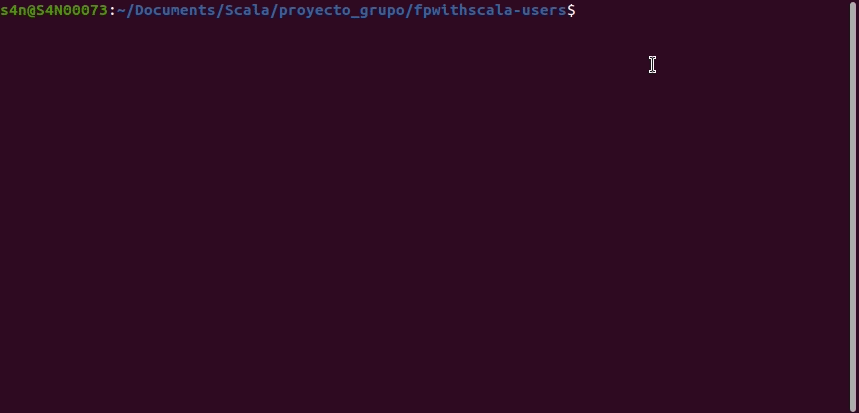
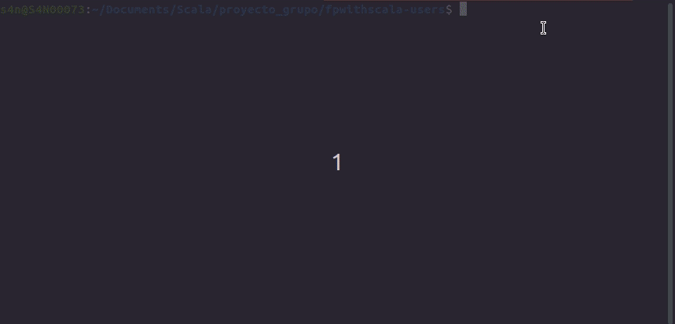
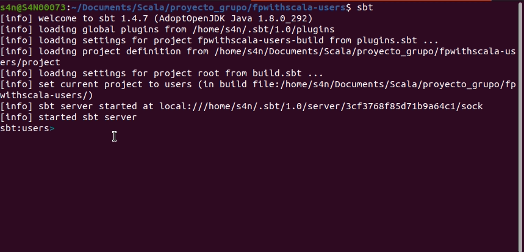

# Introduction

Project created with the Scala programming language, SBT and libraries such as CATS and Http4s, allowing CRUD operations, and using PostgreSQL as the database to save some information about users.

## Minimiun requirements

### Project
  Java 8.0  
  Scala 2.12.1  
  STB 1.5.5  
  
### Database
  Docker 20.10.8  
  docker-compose 1.29.2
  
## Preparations

 - Once you had clone this repository, run the `docker-compose up` command.
 <center>  </center>
 - Once the Postgres is created and container is up and running open the project's folder with you favorite IDE or code editor
 	In case you want to use command line, follow the step below:
 	  1. Open you preferred command terminal
 	  2. type the `sbt` command.
 	   <center>  </center>
 	  3. Once the SBT is activated, type the `run` command.
 	   <center>  </center>
 	  4. By now the project must be running.
 	  
**Note:** Don't forget to open this project as a STB project on your favorite IDE or code editor.

## How it works

### [GET]
**User returned**  
**Request:** 
```http
GET http://localhost:8000/users/12`
``` 
**Return:** 
```javascript
{
  "id":1,
  "legalId":"12",
  "firstName":"Andres",
  "lastName":"Perez",
  "email":"andres_perez@fakemail.com",
  "phone":"123456"
}
```
**User not found**  
**Request:**
```http
GET http://localhost:8000/users/1
```  
**Return:** `The user with legal id 2 doesnt exists`
 
### [POST]
**User created**  
**Request:** 
```http
POST '{"legalId":"2", "firstName":"Jaime","lastName":"Gil","email":"jaime_gil@fakemail.com","phone":"123456"}' 
http://localhost:8000/users
```  
**Return:** 
```javascript
{
  "id":3,
  "legalId":"2",
  "firstName":"Jaime",
  "lastName":"Gil",
  "email":"jaime_gil@fakemail.com",
  "phone":"123456"
}
```
**User with legal id 12 already exist**  
**Request:** 
```http
POST '{"legalId":"12", "firstName":"Andres","lastName":"Perez","email":"andres_perez@fakemail.com","phone":"123456"}' http://localhost:8000/users
```  
**Return:** `The user with legal id 12 already exists`

### [PUT]
**User updated**  
**Request:** 
```http
PUT '{"legalId":"2", "firstName":"Camila","lastName":"Sanchez","email":"camila_sanchez@fakemail.com","phone":"123456"}' http://localhost:8000/users/2
```  
**Return:** `User updated`  
**User not found**  
**Request:** 
```http
PUT '{"legalId":"2", "firstName":"Bart","lastName":"Simpson","email":"elbarto@aycaramba.com","phone":"555555"}' http://localhost:8000/users/20
```  
**Return:** `The user with legal id 20 doesnt exists`

### [DELETE]
**User deleted**  
**Request:** 
```http
DELETE http://localhost:8000/users/2
```  
**Return:** `"--- user deleted"`  
**User not found**  
**Request:** 
```http
DELETE http://localhost:8000/users/20
```  
**Return:** `"--- the user doesn't exists"`

### Issues

  - Need of docker-compose installed *ToBeFixed*
  
## Team
[Diana](https://github.com/DianaRaMo)  
[Isabela](https://github.com/Thezra)  
[Sergio](https://github.com/sv1024)  
[Steven](https://github.com/RyuDesire)


